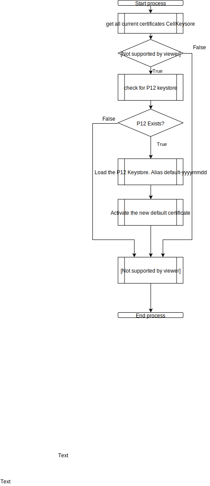
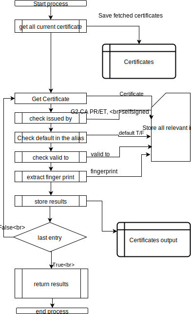

# Certificate Replacement
### The process flow of the renewal of the certificates in the stores can be divided in the step as specified in the diagram 

Location:
* /tmp/certificate

Filenaming:
* vm<>_reg.key (private key)
* vm<>_reg.csr (certificate sign request)
* openssl.conf (input file generated)
* vm<>.p12
*<>.[crt|pem|cer] signed certificate

| | |
|--------------|---------------|
|  |  |
| main flow | Exists certificate fetching|
| ||
| Matching CSR and Certificate and create P12 keystore from them||

The *.svg files contain the embedded DrawIO diagram. To edit just open the files in drawio